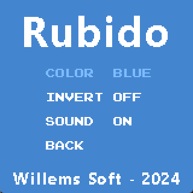
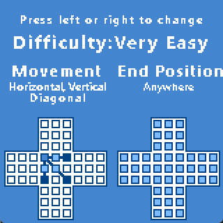
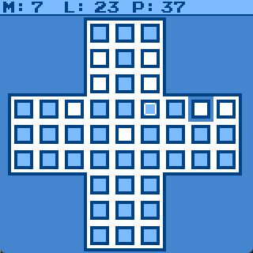

# Rubido WASM4 Version
   

   
 

Rubido is a little chinese checkers or solitaire game with four difficulties.

## WASM4 Game Features:
- Multiple color palettes
- Options screen
- Mouse controls
- Four difficulties
- Saves best results

## Playing the Game:
The aim of the game in chinese checkers is to select a peg on the board and jump over another peg to land on an empty spot. When doing this the peg you jumped over will be removed from the board.
You need to play the game in such a way that only one peg remains on the board at the end. Depending on the difficulty you had chosen this can be either (only) in the middle of the board or anywhere on the board.
Also depending on the difficulty you had chosen you can either jump horizontally and veritically over pegs or diagonally as well.

## Diffuclties 

### Very Easy
- Jump over Pegs vertically, horizontally and diagonally
- Last Peg can be anywhere on the board

### Easy
- Jump over Pegs vertically, horizontally and diagonally
- Last Peg must end on the middle board

### Hard
- Jump over Pegs vertically and horizontally only
- Last Peg can be anywhere on the board

### Very Hard
- Jump over Pegs vertically and horizontally only
- Last Peg must end on the middle board

## Controls

| Keys | Action |
| ------ | ------ |
| arrow keys | Select menu's or difficulties. During gameplay move the peg selector around. |
| x | Confirm in menu and difficulty selector. During gameplay activate the peg where the peg selector is. If there was a peg already selected it will deselect it |
| c | Return to Title Screen |

| Mouse | Action |
| ------ | ------ |
| mouse move | Select menu's or difficulties. During gameplay move the peg selector around. |
| left button | Confirm in menu and difficulty selector. During gameplay activate the peg where the peg selector is. If there was a peg already selected it will deselect it |
| right button | Return to Title Screen |
